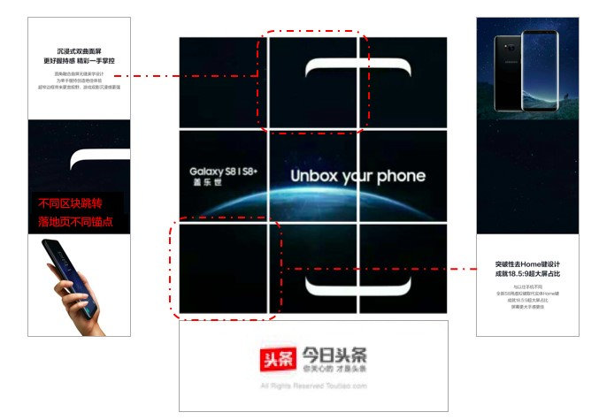

# 开屏 & CPT 广告产品 - 商业化

## **\| 开屏广告** <a id="id-&#x5F00;&#x5C4F;&amp;CPT&#x5E7F;&#x544A;&#x4EA7;&#x54C1;-|&#x5F00;&#x5C4F;&#x5E7F;&#x544A;"></a>

详情请参看：当季最新刊例

* 开屏首刷和轮播CPT售卖需至少**提前5天**下单并提交素材／开屏CPM**提前3天**下单并提交素材
* 目前支持**静态／动态／视频**三种素材样式
* 库存预估及价格请参看当季最新刊例
* 轮播及首刷CPT静态/动态样式支持同一广告计划在一天内实现多个素材创意分小时时间段进行投放展示
* 支持第三方监测
* 不支持APP吊起



## **\| 开屏九宫格** <a id="id-&#x5F00;&#x5C4F;&amp;CPT&#x5E7F;&#x544A;&#x4EA7;&#x54C1;-|&#x5F00;&#x5C4F;&#x4E5D;&#x5BAB;&#x683C;"></a>

详情请参看：[开屏九宫格](https://wiki.bytedance.net/pages/viewpage.action?pageId=87676670)

* 开屏区域将会自动按横纵三等分规则切分为九块，九块的每个面积都可以点击
* 九块区域支持相同或不同链接，不同链接必须跳转同一落地页面的不同锚点
* 仅支持静态、动态两种样式
* 费用上**无单独加收**
* 支持第三方监测
* 不支持APP吊起



## **\| 频道CPT资源盘点** <a id="id-&#x5F00;&#x5C4F;&amp;CPT&#x5E7F;&#x544A;&#x4EA7;&#x54C1;-|&#x9891;&#x9053;CPT&#x8D44;&#x6E90;&#x76D8;&#x70B9;"></a>

详情请参看：当季最新刊例

* 热点频道，4-1～4-4，支持入口素材种类：小图/大图/组图/视频/微动/全景
* 视频频道，4-1～4-4，支持入口素材种类：大图/视频
* 娱乐频道，4-1～4-4，支持入口素材种类：小图/大图/组图/视频/微动/全景
* 财经频道，4-1～4-4，支持入口素材种类：小图/大图/组图/视频/微动/全景
* 国际频道，4-1～4-4，支持入口素材种类：小图/大图/组图/视频/微动/全景
* 军事频道，4-1～4-4，支持入口素材种类：小图/大图/组图/视频/微动/全景
* 科技频道，4-1～4-4，支持入口素材种类：小图/大图/组图/视频/微动/全景
* 汽车频道，4-1～4-4，支持入口素材种类：小图/大图/组图/视频/微动/全景
* 体育频道，4-1～4-4，支持入口素材种类：小图/大图/组图/视频/微动/全景
* 房产频道，4-1～4-4，支持入口素材种类：小图/大图/组图/视频/微动/全景
* 健康频道，4-1～4-4，支持入口素材种类：小图/大图/组图/视频/微动/全景
* 历史频道，4-1～4-4，支持入口素材种类：小图/大图/组图/视频/微动/全景
* 美食频道，4-1～4-4，支持入口素材种类：小图/大图/组图/视频/微动/全景
* 电影频道，4-1～4-4，支持入口素材种类：小图/大图/组图/视频/微动/全景
* 动漫频道，4-1～4-4，支持入口素材种类：小图/大图/组图/视频/微动/全景
* 搞笑频道，4-1～4-4，支持入口素材种类：小图/大图/组图/视频/微动/全景
* 股票频道，4-1～4-4，支持入口素材种类：小图/大图/组图/视频/微动/全景
* 故事频道，4-1～4-4，支持入口素材种类：小图/大图/组图/视频/微动/全景
* 家居频道，4-1～4-4，支持入口素材种类：小图/大图/组图/视频/微动/全景
* 教育频道，4-1～4-4，支持入口素材种类：小图/大图/组图/视频/微动/全景
* 游戏频道，4-1～4-4，支持入口素材种类：小图/大图/组图/视频/微动/全景
* 旅游频道，4-1～4-4，支持入口素材种类：小图/大图/组图/视频/微动/全景
* 时尚频道，4-1～4-4，支持入口素材种类：小图/大图/组图/视频/微动/全景
* 数码频道，4-1～4-4，支持入口素材种类：小图/大图/组图/视频/微动/全景
* 文化频道，4-1～4-4，支持入口素材种类：小图/大图/组图/视频/微动/全景
* 养生频道，4-1～4-4，支持入口素材种类：小图/大图/组图/视频/微动/全景
* 育儿频道，4-1～4-4，支持入口素材种类：小图/大图/组图/视频/微动/全景
* 孕产频道，4-1～4-4，支持入口素材种类：小图/大图/组图/视频/微动/全景
* 支持针对同一广告计划在一天内实现多个素材创意分小时时间段进行投放展示；
* 支持针对同一个广告计划在一天内实现多个素材创意分标签进行投放展示；
* 热点频道行业限制，仅允许：交通、通讯服务、房地产、奢侈品、食品饮料、家用电器、手机数码、电脑硬件办公、化妆护理、政府组织类、政府机构、传统金融

> 撒as啊啊
>
> 阿斗啊打打打阿萨德
>
> 阿斗速度阿萨德



阿萨德as

as大师的








 阿萨阿萨德德































```

```








文档1



文档2




$$
1+2=3
$$


| 表格1  | 表格4 | 表格5 |
| :--- | :--- | :--- |
| 表格2 | 表格3 | 表格6 |
|  |  |  |

